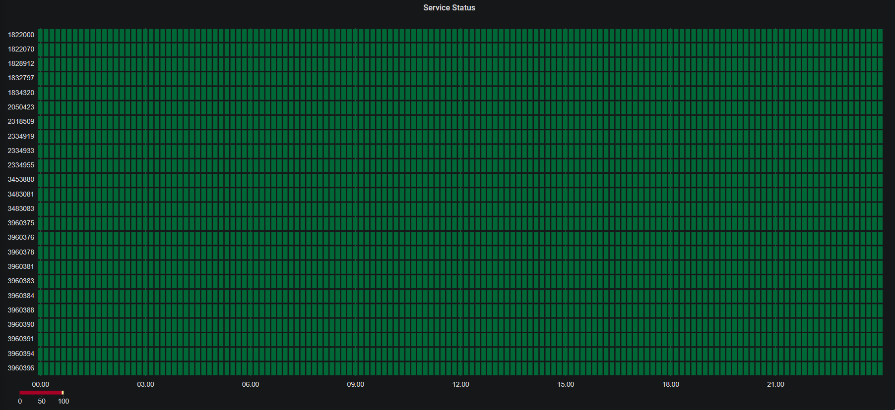

[](https://craigg.visualstudio.com/Pipelines/_build/latest?definitionId=19&branchName=master)


# Status Cake Exporter

Status Cake Exporter is a Prometheus expoter for [StatusCake](https://www.statuscake.com/).

Metrics are exposed on port 8080. E.g.

```
http://status-cake-exporter.default.svc:8080
```

## Usage

| Setting  | Required | Default |
|----------|----------|---------|
| USERNAME | Yes      | Null    | 
| API_KEY  | Yes      | Null    |
| TAGS     | No       | Null    |
| LOG_LEVEL| No       | info    | 

### Docker

```
export USERNAME=statuscakeuser
export API_KEY=xxxxxxxx
docker run --env USERNAME --env API_KEY chelnak/status-cake-exporter:latest
```

### Kubernetes

Use [examples/manifest.yml](examples/manifest.yml) as an example

### Terminal

```
usage: app.py [-h] [--username USERNAME] [--api-key API_KEY]
              [--tests.tags TAGS] [--logging.level {debug,info,warn,error}]

If an arg is specified in more than one place, then commandline values
override environment variables which override defaults.

optional arguments:
  -h, --help            show this help message and exit
  --username USERNAME   Username for the account [env var: USERNAME]
  --api-key API_KEY     API key for the account [env var: API_KEY]
  --tests.tags TAGS     A comma separated list of tags used to filter tests returned from the api [env var: TAGS]
  --logging.level       {debug,info,warn,error} Set a log level for the application [env var: LOG_LEVEL]
```                    

## Metrics

| Name| Type | Description |
|-----|------|-------------|
| status_cake_test_info | Gauge |A basic listing of the tests under the current account. |
| status_cake_test_uptime_percent | Gauge | Tests and their uptime percetage |

## Prometheus

Prometheus config needs to be updated in order to see the new exported. Use the following scrape config as an example:

```Yaml
scrape_configs:
    - job_name: status-cake-exporter
    honor_timestamps: true
    scrape_interval: 10m
    scrape_timeout: 1m
    metrics_path: /
    scheme: http
    static_configs:
    - targets:
        - status-cake-exporter.default.svc:8000
```

## Grafana
Data collected by Prometheus can ne easily surfaced in Grafana.

Using the [Statusmap panel](https://grafana.com/grafana/plugins/flant-statusmap-panel) by [flant](https://github.com/flant/grafana-statusmap) you can create a basic status visualization:



### PromQL
```PromQL
(status_cake_test_info + on(test_id) group_right(test_name) (0 * status_cake_test_uptime_percent)) * 100
```